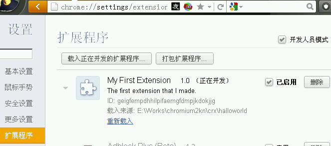
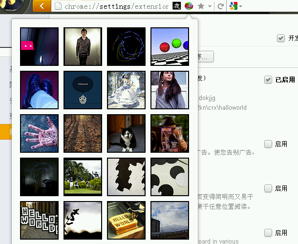

.. include:: ../LINKS.rst

.. _chapter0hallo:

扩展入门
====================

这一简单的教程,将带领我们创作一个简单的扩展,
我们将一个小图标放入浏览器,点击时,会自动生成小的弹出页面.
效果类似:

.. figure:: ../_static/images/hello-world-small.png

   
在 `Chrome`_ 平台的支持下,
我们的扩展可以平滑运行在任何 `Chrome`_ 兼容的浏览器中,以及任何操作系统中!
而扩展本身不用修订任何代码!

创建并加载扩展
----------------------------------------

我们将创建一种 ":ref:`浏览行为 <chapter1-BrowserActions>` "式的扩展,
将在浏览器工具栏中增加一个你可以控制其行为的图标.

#. 先在电脑里找个地方建立专用目录以便存放扩展工程(可以是 `Works\crx\hollworld`)
#. 在这个扩展目录中,先创建配置文件: `manifest.json` 内容如下::

    {
      "name": "My First Extension",
      "version": "1.0",
      "manifest_version": 2,
      "description": "The first extension that I made.",
      "browser_action": {
        "default_icon": "icon.png"
      },
      "permissions": [
        "http://api.flickr.com/"
      ]
    }

#. 复制图标到同一目录中: 

.. figure:: ../_static/examplex/tutorials/getstarted/icon.png 

    下载 icon.png

#. 加载扩展:

    #. 从菜单 `选项->扩展程序` 进入扩展管理界面
    #. 如果 `开发者模式` 没有开启,请选取单选框启动,就可以看见更多的功能按钮
    #. 点击 `载入正在的扩展程序` 按钮,将弹出文件对话框
    #. 选择刚才创建的专用目录,点击 `载入正在的扩展程序` 按钮,将弹出文件对话框

    当扩展加载有效时,图标就出现在工具栏

填入代码
----------------------------------------

这一阶段将使我们的扩展除了漂亮外真正 `做` 点儿什么!

#. 编辑 `manifest.json` 追加几行::

    ...
    "browser_action": {
        "default_icon": "icon.png",
        "default_popup": "popup.html"
    },
    ...

    并在扩展目录中创建两个文本文件: `popup.html` 以及 `popup.js`
    详细内容见后文

#. 回到扩展管理界面, 点击 `重新载入` ,以便加载全新的代码
#. 再点击工具栏中的图标,就会出现 `popup.html` 中生成的内容

    效果应该类似以上截屏

.. note:: (~_~)

    - 如果没有见到以上弹出内容,可以跟随以上过程,再重新来一遍
    - 记住,从扩展的开发目录中直接打开 `popup.html` 那样是不会起作用的!

popup.html
^^^^^^^^^^^^^^^^^^^^^

.. code-block:: html

    <!doctype html>
    <html>
      <head>
        <title>Getting Started Extension's Popup</title>
        

        <!-- JavaScript and HTML must be in separate files for security. -->
        
      </head>
      <body>
      </body>
    </html>

popup.js
^^^^^^^^^^^^^^^^^^^^^

.. code-block:: js
  :emphasize-lines: 3,5
  
    // Copyright (c) 2012 The Chromium Authors. All rights reserved.
    // Use of this source code is governed by a BSD-style license that can be
    // found in the LICENSE file.

    var req = new XMLHttpRequest();
    req.open(
        "GET",
        "http://api.flickr.com/services/rest/?" +
            "method=flickr.photos.search&" +
            "api_key=90485e931f687a9b9c2a66bf58a3861a&" +
            "text=hello%20world&" +
            "safe_search=1&" +  // 1 is "safe"
            "content_type=1&" +  // 1 is "photos only"
            "sort=relevance&" +  // another good one is "interestingness-desc"
            "per_page=20",
        true);
    req.onload = showPhotos;
    req.send(null);

    function showPhotos() {
      var photos = req.responseXML.getElementsByTagName("photo");

      for (var i = 0, photo; photo = photos[i]; i++) {
        var img = document.createElement("image");
        img.src = constructImageURL(photo);
        document.body.appendChild(img);
      }
    }

    // See: http://www.flickr.com/services/api/misc.urls.html
    function constructImageURL(photo) {
      return "http://farm" + photo.getAttribute("farm") +
          ".static.flickr.com/" + photo.getAttribute("server") +
          "/" + photo.getAttribute("id") +
          "_" + photo.getAttribute("secret") +
          "_s.jpg";
    }

现在? 
----------------------------------------

接下来读点儿什么? :
    - 包含了各种重要概念和信息的 :ref:`综述 <chapter0overview>`
    - :ref:`调试教程 <chapter2debugging>` 是进入下一个开发级别的重要文档

..    The hosting page, which tells you about options for distributing your extension

如果你不喜欢阅读,可以尝试:
    - 通过订阅列表来关注最新进展: `订阅chromium-extensions <http://groups.google.com/a/chromium.org/group/chromium-extensions/subscribe>`_
    - 在 `Stack Overflow <http://stackoverflow.com/questions/tagged/google-chrome-extension>`_ 使用 [google-chrome-extension] 为标签来提问
    - 体验 :ref:`扩展样例 <chapter4index>` 
    - 找些视频来看,比如说:

        - `How to build an extension <http://www.youtube.com/watch?v=e3McMaHvlBY&feature=PlayList&p=CA101D6A85FE9D4B&index=3>`_
        - `{10月13日语音讲座vol.28}ZQ: Chrome插件开发基础 <http://bbs.code.ijinshan.com/thread-1424-1-3.html>`_
        - `{10月20日语音讲座vol.29}ZQ: Chrome插件开发实例 <http://bbs.code.ijinshan.com/thread-1427-1-3.html>`_

    Watch some videos, such as How to build an extension

.. seealso:: (^.^)
    
    原文: `Getting Started <http://code.google.com/chrome/extensions/getstarted.html>`_
