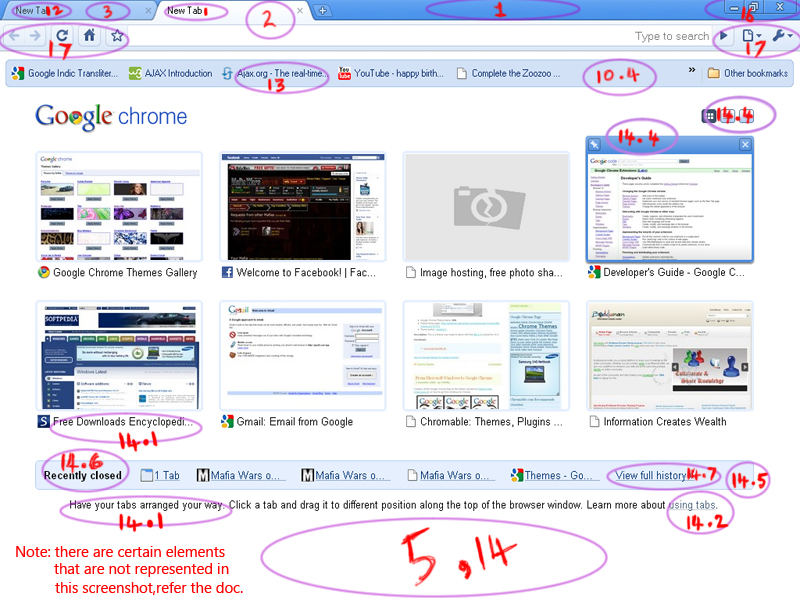

.. include:: ../LINKS.rst

.. _chapter5TCG:

主题主题皮肤创建手册 
==============================================================================

官方文档中指出主题皮肤创建中要上 `*.cc` 代码中翻找相关信息,对于纯粹的设计人员而言,太囧!
所以,需要一份清晰的手册,指引设计人员快速完成主题皮肤的设计.

所以,有了当前这份:ThemesCreationGuide ~ 主题主题皮肤创建手册!

创建主题皮肤必须作的事儿
---------------------------------------------------------------------

- 一个靠谱的文本编辑器是必须的(至少要有行号,语法主题皮肤等等支持,因为 Chrome 对非良构的 manifest.json是零容忍的, 对于M$用户Notepad++ 是个好选择,笔者推荐新兴跨平台编辑器 Sublime Text 2 )如果对 JSON 文本实在没有感觉,可以尝试在线主题皮肤制作工具,比如: http://www.themebeta.com/chrome-theme-creator-online.html
- 一个靠谱的图像管理器,好工具能帮助你创造好内容,强烈推荐 Photoshop , 同时推荐正版免费软件 Gimp 或是 Paint. 
- 如果你在使用 Photoshop, 就可以下载 `Chrome 窗口设计稿 <http://www.chromium.org/user-experience/visual-design/chrome_0.2_psd.zip>`_ 已经将不同元素整理到不同层,方便进行效果调整.
- 运用一些颜色/模式/设计的创意原则,来控制主题皮肤的整体感观
- 将你的成果打包,并通过以下渠道发布:
    + 直接上传到 `Chrome网上主题皮肤店`_
    + 使用 Chrome 打包,参考: :ref:`发布托管 <chapter1-Hosting>` 或是原文: `Hosting <https://developer.chrome.com/extensions/hosting.html>`_
    + 自行制作 `.crx` , 参考: :ref:`打包 <chapter1-Packaging>` 或是原文: `Packaging <https://developer.chrome.com/extensions/packaging.html>`_

相关工具的配合
---------------------------------------------------------------------

.. _fig_5_t_1:

    主题皮肤可定制元素索引

参考以上图片,标出了所有可以进行定制的主题皮肤元素,
我们将使用以上数字逐一说明怎样定制对应UI!

- 首先,创立以主题皮肤名为目录名的空白目录作工程容器.
- 然后,创建两样东西:
  + 将创建的图片(png格式)收集在 `images` 目录
  + 创建最重要的 :ref:`manifest.json <chapter3-manifest>` 清单文件, 这是主题皮肤扩展要求必须有的文件!
    - 使用普通的文本编辑器即可进行编辑
    - 注意,文件名必须全小写
- 最后,就可以进行打包测试了.

在 Chrome 中有很多东西可以主题皮肤化,详细的参考下文 "主题皮肤元素描述" 一节.

主题皮肤可定制元素
---------------------------------------------------------------------

图片 Image Elements
^^^^^^^^^^^^^^^^^^^^^^^    

图片元素在 :ref:`manifest.json <chapter3-manifest>` 中 `images` 一节定义

.. list-table:: 图片元素
   :widths: 5 25 10 10
   :header-rows: 1

   * - 标号
     - 说明
     - manifest.json 参数
     - 建议尺寸(宽x高)
   * - 1
     - 顶部,Chrome 标签背景区域
     - :ref:`"theme_frame" <TCG-theme_frame>`
     - ∞ x 80
   * - 1.1
     - 区域同上,仅在不活跌时生效
     - :ref:`"theme_frame_inactive" <TCG-theme_frame_inactive>`
     - ~
   * - 1.2
     - 区域同上,但在"匿名模式"下窗口激活时生效
     - :ref:`"theme_frame_incognito" <TCG-theme_frame_incognito>`
     - ~
   * - 1.3
     - 区域同上,但在"匿名模式"下窗口不活跃时生效
     - :ref:`"theme_frame_incognito_inactive" <TCG-theme_frame_incognito_inactive>`
     - ~
   * - 2
     - 包含当前标签同工具栏一起的表现
     - :ref:`"theme_toolbar" <TCG-theme_toolbar>`
     - ∞ x 120
   * - 3
     - 覆盖所有未激活标签区域
     - :ref:`"theme_tab_background" <TCG-theme_tab_background>`
     - ∞ x 65
   * - 3.1
     - 区域同上,但浏览器在"匿名模式"下
     - :ref:`"theme_tab_background_incognito" <TCG-theme_tab_background_incognito>`
     - ~
   * - 4
     - 标签背景,可以容纳各种事务*(规划中)
     - :ref:`"theme_tab_background_v" <TCG-theme_tab_background_v>`
     - ~
   * - 5
     - 是主题样式的最大背景
     - :ref:`"theme_ntp_background" <TCG-theme_ntp_background>`
     - 最小也应是: 800x600
   * - 6
     - 在frame 左侧顶层显示的图片
     - :ref:`"theme_frame_overlay" <TCG-theme_frame_overlay>`
     - 110 x 40
   * - 6.1
     - 区域同前,仅在窗口不活跃时生效
     - ref:`"theme_frame_overlay_inactive" <TCG-theme_frame_overlay_inactive>`
     - ~
   * - 7
     - 标签工具栏按钮背景
     - :ref:`"theme_button_background" <TCG-theme_button_background>`
     - 30 x 30
   * - 8
     - 此图片将显示在"theme created by" 一节
     - :ref:`"theme_ntp_attribution" <TCG-theme_ntp_attribution>`
     - ~
   * - 9
     - 窗口控制按钮背景(关闭,最小,,,)
     - :ref:`"theme_window_control_background" <TCG-theme_window_control_background>`
     - ~

Color Elements
^^^^^^^^^^^^^^^^^^^^^^^    

.. list-table:: 颜色元素
   :widths: 5 25 10
   :header-rows: 1

   * - 标号
     - 说明
     - manifest.json 参数
   * - 标号
     - 说明
     - manifest.json 参数

Tint Elements
^^^^^^^^^^^^^^^^^^^^^^^    
.. list-table:: 色调元素
   :widths: 5 25 10
   :header-rows: 1

   * - 标号
     - 说明
     - manifest.json 参数
   * - 标号
     - 说明
     - manifest.json 参数

UI Property Elements
^^^^^^^^^^^^^^^^^^^^^^^    

.. list-table:: 界面属性
   :widths: 5 25 10
   :header-rows: 1

   * - 标号
     - 说明
     - manifest.json 参数
   * - 标号
     - 说明
     - manifest.json 参数

主题皮肤元素描述 Description of Elements
--------------------------------------------------------------------------------------------

Basic Theme Elements
^^^^^^^^^^^^^^^^^^^^^^^    

.. _TCG-theme_frame:

- theme_frame:
  - desc

.. _TCG-theme_toolbar:

- theme_toolbar:
  - desc

.. _TCG-theme_tab_background:

- theme_tab_background:
  - desc

.. _TCG-theme_ntp_background:

- theme_ntp_background:
  - desc

Advanced Theme Elements
^^^^^^^^^^^^^^^^^^^^^^^    

.. _TCG-theme_frame_inactive:

- theme_frame_inactive:
  - desc

.. _TCG-theme_frame_incognito:

- theme_frame_incognito:
  - desc

.. _TCG-theme_frame_incognito_inactive:

- theme_frame_incognito_inactive:
  - desc

.. _TCG-theme_tab_background_incognito:

- theme_tab_background_incognito:
  - desc

.. _TCG-theme_tab_background_v:

- theme_tab_background_v:
  - desc

.. _TCG-theme_frame_overlay_inactive:

- theme_frame_overlay_inactive:
  - desc

.. _TCG-theme_button_background:

- theme_button_background:
  - desc

.. _TCG-theme_ntp_attribution:

- theme_ntp_attribution:
  - desc

.. _TCG-theme_window_control_background:

- theme_window_control_background:
  - desc

.. _TCG-Frame:

- Frame:
  - desc

.. _TCG-Frame_inactive:

- Frame_inactive:
  - desc

.. _TCG-Frame_incognito:

- Frame_incognito:
  - desc

.. _TCG-Frame_incognito_inactive:

- Frame_incognito_inactive:
  - desc

.. _TCG-toolbar:

- toolbar:
  - desc

.. _TCG-tab_text:

- tab_text:
  - desc

.. _TCG-tab_background_text:

- tab_background_text:
  - desc

.. _TCG-bookmark_text:

- bookmark_text:
  - desc

.. _TCG-ntp_background:

- ntp_background:
  - desc

.. _TCG-ntp_text:

- ntp_text:
  - desc

.. _TCG-ntp_link:

- ntp_link:
  - desc

.. _TCG-ntp_link_underline:

- ntp_link_underline:
  - desc

.. _TCG-ntp_header:

- ntp_header:
  - desc

.. _TCG-ntp_section:

- ntp_section:
  - desc

.. _TCG-ntp_section_text:

- ntp_section_text:
  - desc

.. _TCG-ntp_section_link:

- ntp_section_link:
  - desc

.. _TCG-ntp_section_link_underline:

- ntp_section_link_underline:
  - desc

.. _TCG-control_background:

- control_background:
  - desc

.. _TCG-button_background:

- button_background:
  - desc

.. _TCG-buttons:

- buttons:
  - desc

.. _TCG-frame:

- frame:
  - desc

.. _TCG-frame_inactive:

- frame_inactive:
  - desc

.. _TCG-frame_incognito:

- frame_incognito:
  - desc

.. _TCG-frame_incognito_inactive:

- frame_incognito_inactive:
  - desc

.. _TCG-background_tab:

- background_tab:
  - desc

.. _TCG-ntp_background_alignment:

- ntp_background_alignment:
  - desc

.. _TCG-ntp_background_repeat:

- ntp_background_repeat:
  - desc

.. _TCG-ntp_logo_alternate:

- ntp_logo_alternate:
  - desc

Packaging
^^^^^^^^^^^^^^^^^^^^^^^    

demo: 轻简生活
^^^^^^^^^^^^^^^^^^^^^^^    

.. code-block:: json
  :emphasize-lines: 2-5,219,246-253

    {
        "version": "1",
        "manifest_version": 2,
        "name": "轻简生活",
        "theme": {
            "images": {
                "theme_frame": "i/theme_frame.png",
                "theme_popupframe": "i/theme_popupframe_default.png",
                "theme_frame_inactive": "i/theme_frame.png",

                "theme_inactive_tab_left": "i/theme_inactive_tab_left.png",
                "theme_inactive_tab_right": "i/theme_inactive_tab_right.png",
                "theme_inactive_tab_center": "i/theme_inactive_tab_center.png",
                "theme_active_tab_left": "i/theme_active_tab_left.png",
                "theme_active_tab_right": "i/theme_active_tab_right.png",
                "theme_active_tab_center": "i/theme_active_tab_center.png",
                "newtab_btn_n": "i/newtab_btn_n.png",
                "newtab_btn_h": "i/newtab_btn_h.png",
                "newtab_btn_p": "i/newtab_btn_p.png",
                "closetab_btn_n": "i/closetab_btn_n.png",
                "closetab_btn_h": "i/closetab_btn_h.png",
                "closetab_btn_p": "i/closetab_btn_p.png",

                "tab_separator": "i/tab_separator.png",

                "typical_frame": "i/typical_frame.png",
                "typical_frame_inactive": "i/typical_frame_inactive.png",

                "theme_menu_title": "i/menu_title_bkg.png",
                "theme_menu_item_highlight": "i/menu_item_highlight.png",
                "theme_menu_item_check_round": "i/menu_item_check_round.png",
                "theme_menu_item_check_tick": "i/menu_item_check_tick.png",
                "theme_menu_item_check_tick_select": "i/menu_item_check_tick_highlight.png",
                "theme_menu_title_login_button_h": "i/menu_title_login_button_h.png",
                "theme_menu_title_login_button_n": "i/menu_title_login_button_n.png",
                "theme_menu_title_login_button_p": "i/menu_title_login_button_p.png",
                "theme_menu_title_logo": "i/menu_title_logo.png",
                "theme_menu_title_tab_button_cloud_h": "i/menu_title_tab_button_cloud_h.png",
                "theme_menu_title_tab_button_cloud_n": "i/menu_title_tab_button_cloud_n.png",
                "theme_menu_title_tab_button_cloud_p": "i/menu_title_tab_button_cloud_p.png",
                "theme_menu_title_tab_button_info_h": "i/menu_title_tab_button_info_h.png",
                "theme_menu_title_tab_button_info_n": "i/menu_title_tab_button_info_n.png",
                "theme_menu_title_tab_button_info_p": "i/menu_title_tab_button_info_p.png",
                "theme_menu_title_tab_button_main_h": "i/menu_title_tab_button_main_h.png",
                "theme_menu_title_tab_button_main_n": "i/menu_title_tab_button_main_n.png",
                "theme_menu_title_tab_button_main_p": "i/menu_title_tab_button_main_p.png",
                "theme_menu_title_tab_splite": "i/menu_title_tab_splite.png",
                "theme_menu_title_user_name_marker": "i/menu_title_user_name_marker.png",
                "theme_menu_title_user_name_hover": "i/menu_title_user_name_hover.png",
                "theme_menu_cloud_item_bookmark": "i/menu_cloud_item_bookmark.png",
                "theme_menu_cloud_item_sync_loading": "i/menu_cloud_item_sync_loading.png",
                "theme_location_bar_back_d": "i/location_bar_back_d.png",
                "theme_location_bar_back_h": "i/location_bar_back_h.png",
                "theme_location_bar_back_n": "i/location_bar_back_n.png",
                "theme_location_bar_back_p": "i/location_bar_back_p.png",
                "theme_location_bar_border_focus": "i/location_bar_border_focus.png",
                "theme_location_bar_border_only_focus": "i/location_bar_border_only_focus.png",
                "theme_location_bar_dropdown_button_h": "i/location_bar_dropdown_button_h.png",
                "theme_location_bar_dropdown_button_n": "i/location_bar_dropdown_button_n.png",
                "theme_location_bar_dropdown_button_p": "i/location_bar_dropdown_button_p.png",
                "theme_location_bar_forward_d": "i/location_bar_forward_d.png",
                "theme_location_bar_forward_h": "i/location_bar_forward_h.png",
                "theme_location_bar_forward_n": "i/location_bar_forward_n.png",
                "theme_location_bar_forward_p": "i/location_bar_forward_p.png",
                "theme_location_bar_forward_withpay_h": "i/location_bar_forward_withpay_h.png",
                "theme_location_bar_forward_withpay_n": "i/location_bar_forward_withpay_n.png",
                "theme_location_bar_forward_withpay_p": "i/location_bar_forward_withpay_p.png",

                "theme_location_bar_goto_h": "i/location_bar_goto_h.png",
                "theme_location_bar_goto_n": "i/location_bar_goto_n.png",
                "theme_location_bar_goto_p": "i/location_bar_goto_p.png",
                "theme_location_bar_reload_h": "i/location_bar_reload_h.png",
                "theme_location_bar_reload_n": "i/location_bar_reload_n.png",
                "theme_location_bar_reload_p": "i/location_bar_reload_p.png",
                "theme_location_bar_result_view_closebtn_h": "i/location_bar_result_view_closebtn_h.png",
                "theme_location_bar_result_view_closebtn_n": "i/location_bar_result_view_closebtn_n.png",
                "theme_location_bar_result_view_closebtn_selected_h": "i/location_bar_result_view_closebtn_selected_h.png",
                "theme_location_bar_result_view_closebtn_selected_n": "i/location_bar_result_view_closebtn_selected_n.png",
                "theme_location_bar_result_view_h_background": "i/location_bar_result_view_h_background.png",
                "theme_location_bar_result_view_s_background": "i/location_bar_result_view_s_background.png",
                "theme_location_bar_safebrowsing_warning": "i/location_bar_safebrowsing_warning.png",
                "theme_location_bar_star": "i/location_bar_star.png",
                "theme_location_bar_star_lit": "i/location_bar_star_lit.png",
                "theme_location_bar_stop_d": "i/location_bar_stop_d.png",
                "theme_location_bar_stop_h": "i/location_bar_stop_h.png",
                "theme_location_bar_stop_n": "i/location_bar_stop_n.png",
                "theme_location_bar_stop_p": "i/location_bar_stop_p.png",
                "theme_searchbar_border_focus": "i/searchbar_border_focus.png",
                "theme_searchbar_engs_icon_h": "i/searchbar_engs_icon_h.png",
                "theme_searchbar_engs_icon_n": "i/searchbar_engs_icon_n.png",
                "theme_searchbar_engs_icon_p": "i/searchbar_engs_icon_p.png",
                "theme_searchbar_icon_h": "i/searchbar_icon_h.png",
                "theme_searchbar_icon_n": "i/searchbar_icon_n.png",
                "theme_searchbar_icon_p": "i/searchbar_icon_p.png",
                "theme_searchbar_engs_is_default": "i/searchbar_engs_is_default.png",
                "theme_tabstripbar_left_background": "i/theme_tabstripbar_left_background.png",
                "theme_tabstripbar_right_background": "i/theme_tabstripbar_right_background.png",

                "progress_button_background": "i/progress_button_background.png",
                "ks_download": "i/download.png",
                "ks_download_p": "i/download_p.png",
                "ks_download_h": "i/download_h.png",
                "ks_downloading": "i/downloading.png",
                "ks_downloading_p": "i/downloading_p.png",
                "ks_downliading_h": "i/downloading_h.png",
                "progress_bottom_img": "i/progress_bottom_img.png",
                "progress_top_img": "i/progress_top_img.png",
                "progress_button_mask": "i/progress_button_mask.png",

                "safety_n": "i/safety_n.png",
                "safety_h": "i/safety_h.png",
                "safety_p": "i/safety_p.png",

                "safe_login_manager_btn_n": "i/safe_login_manager_btn_n.png",
                "safe_login_manager_btn_h": "i/safe_login_manager_btn_h.png",
                "safe_login_manager_btn_p": "i/safe_login_manager_btn_p.png",

                "fav_button_n": "i/fav_button_n.png",
                "fav_button_h": "i/fav_button_h.png",
                "fav_button_p": "i/fav_button_p.png",

                "skin_btn_n": "i/skin_button_n.png",
                "skin_btn_h": "i/skin_button_h.png",
                "skin_btn_p": "i/skin_button_p.png",

                "multi_tab_preview_btn_n" : "i/multi_tab_preview_btn_n.png",
                "multi_tab_preview_btn_h" : "i/multi_tab_preview_btn_h.png",
                "multi_tab_preview_btn_p" : "i/multi_tab_preview_btn_p.png",

                "min_btn_n": "i/min_button_n.png",
                "min_btn_h": "i/min_button_h.png",
                "min_btn_p": "i/min_button_p.png",

                "max_btn_n": "i/max_button_n.png",
                "max_btn_h": "i/max_button_h.png",
                "max_btn_p": "i/max_button_p.png",

                "restore_btn_n": "i/restore_button_n.png",
                "restore_btn_h": "i/restore_button_h.png",
                "restore_btn_p": "i/restore_button_p.png",

                "close_btn_n": "i/close_button_n.png",
                "close_btn_h": "i/close_button_h.png",
                "close_btn_p": "i/close_button_p.png",

                "home_btn_n": "i/homepage_n.png",
                "home_btn_h": "i/homepage_h.png",
                "home_btn_p": "i/homepage_p.png",

                "undo_btn_n": "i/undo_button_n.png",
                "undo_btn_d": "i/undo_button_d.png",
                "undo_btn_p": "i/undo_button_p.png",
                "undo_btn_h": "i/undo_button_h.png",

                "icon_button_mask": "i/account_mask.png",
                "account_btn_icon": "i/account_icon.png",
                "account_failed_btn_icon": "i/account_failed_icon.png",
                "cloud_btn_icon": "i/cloud_icon.png",
                "cloud_failed_btn_icon": "i/cloud_failed_icon.png",
                "message_btn_icon": "i/message_icon.png",
                "account_rotate": "i/account_rotate.png",
                "account_breath": "i/account_breath.png",
                "icon_button_edge_n": "i/account_edge_n.png",
                "icon_button_edge_h": "i/account_edge_h.png",
                "icon_button_edge_p": "i/account_edge_h.png",

                "dialog_bg": "i/dialog_bg.png",
                "throbber_waiting": "i/loading.png",

                "bookmark_bar_folder": "i/bookmark_bar_folder.png",
                "bookmark_btn_bk_h": "i/bookmark_btn_bk_h.png",
                "bookmark_btn_bk_p": "i/bookmark_btn_bk_p.png",
                "default_fav_icon": "i/default_fav_icon.png",

                "dialog_button_n": "i/dialog_button_n.png",
                "dialog_button_h": "i/dialog_button_h.png",
                "dialog_button_p": "i/dialog_button_p.png",
                "bubble_button_n": "i/bubble_button_n.png",
                "bubble_button_h": "i/bubble_button_h.png",
                "bubble_button_p": "i/bubble_button_p.png",

                "check_n": "i/check_n.png",
                "check_h": "i/check_h.png",
                "check_p": "i/check_p.png",
                "check_u_n": "i/check_u_n.png",
                "check_u_h": "i/check_u_h.png",
                "check_u_p": "i/check_u_p.png",
                "radio_selected_n": "i/radio_selected_n.png",
                "radio_selected_h": "i/radio_selected_h.png",
                "radio_selected_p": "i/radio_selected_p.png",
                "radio_unselect_n": "i/radio_unselect_n.png",
                "radio_unselect_h": "i/radio_unselect_h.png",
                "radio_unselect_p": "i/radio_unselect_p.png",

                "bookmark_bar_bk": "i/bookmark_bar_bk.png",

                "newtab_favicon": "i/newtab.png",
                "bookmarks_favicon": "i/bookmark.png",
                "history_favicon": "i/history.png",
                "settings_favicon": "i/setting.png",

                "button_shine": "i/button_shine.png",

                "user_login_dropdown_button_h": "i/dropdown_button_h.png",
                "user_login_dropdown_button_p": "i/dropdown_button_p.png",
                "user_login_btn_n": "i/user_login_btn_n.png",
                "user_login_btn_h": "i/user_login_btn_h.png",
                "user_login_btn_p": "i/user_login_btn_p.png",
                "user_qq_login_btn_h": "i/user_qq_login_btn_h.png",
                "user_qq_login_btn_p": "i/user_qq_login_btn_p.png",
                "user_login_link_bk_n": "i/user_login_link_bk_n.png",
                "user_login_link_bk_h": "i/user_login_link_bk_h.png",
                "user_login_link_bk_p": "i/user_login_link_bk_p.png",
             
                "safety_abnormal_n": "i/safety_abnormal_n.png",  
                "safety_abnormal_p": "i/safety_abnormal_p.png",  
                "safety_abnormal_h": "i/safety_abnormal_h.png"   
            },
            "colors": {
                "tab_text": [42, 43, 44],
                "tab_background_text": [42, 43, 44],
                "color_menu_container_bkg": [248, 248, 248],
                "color_menu_item_bkg": [248, 248, 248],
                "color_menu_title_user_name": [60, 60, 60],
                "color_menu_title_description": [110, 110, 110],
                "color_menu_title_text_prompt": [255, 115, 15],
                "color_menu_content_prompt": [212, 112, 151],

                "typical_frame_color": [205, 205, 212],
                "typical_frame_color_inactive": [239, 239, 241],
                "color_bookmark_text": [92, 96, 105],
                "color_bookmark_hov_text": [255, 255, 255],
                "color_bookmark_high_text": [255, 255, 255],

                "color_status_text": [130, 130, 130],
                "color_status_background": [199, 206, 222],

                "bookmark_text": [92, 96, 105],
                "bookmark_press_link": [255, 255, 255],
                "color_locationbar_resulturl_texthighlight": [252, 162, 85],
                "color_user_login_link_text": [75, 102, 119],

                "color_button_text_h": [105, 105, 108],
                "color_button_text_p": [105, 105, 108]
            },
            "properties": {
                "property_locationbar_forward_alwaysshow": 0,
                "bookmark_btn_inset_lr": 5,
                "property_frame_bkg_tiled": 1
            },
            "layouts": {
                "layout_main": "i/layout_main"
            }
        }
    }

.. seealso:: (^.^)
    
    原文: `Theme Creation Guide <https://code.google.com/p/chromium/wiki/ThemeCreationGuide>`_
